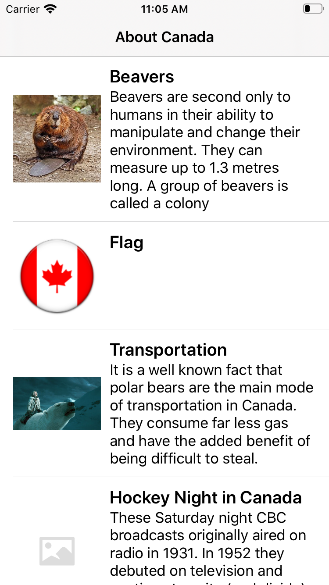

# Facts
Coding Test submission to @ Wipro Digital by Bilven Parikh

# Codign Details :
1. Build a native iOS app to support both iPHone and iPad devices.
2. Display the photos with title and description.
3. Supports the iOS version from iOS 11.0.
4. Code tested in iPhone and iPad both in Landscape and Portrait mode.
5. Addec XCUnit Test Cases.

# App Architecture :

Followed MVVM Architecture

# App Screenshots :

